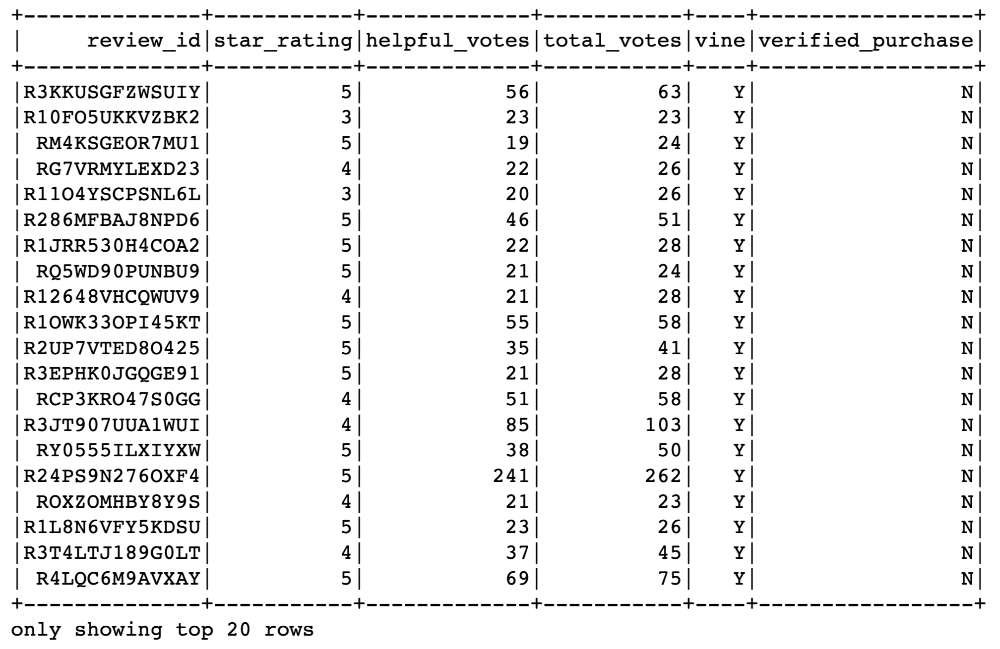
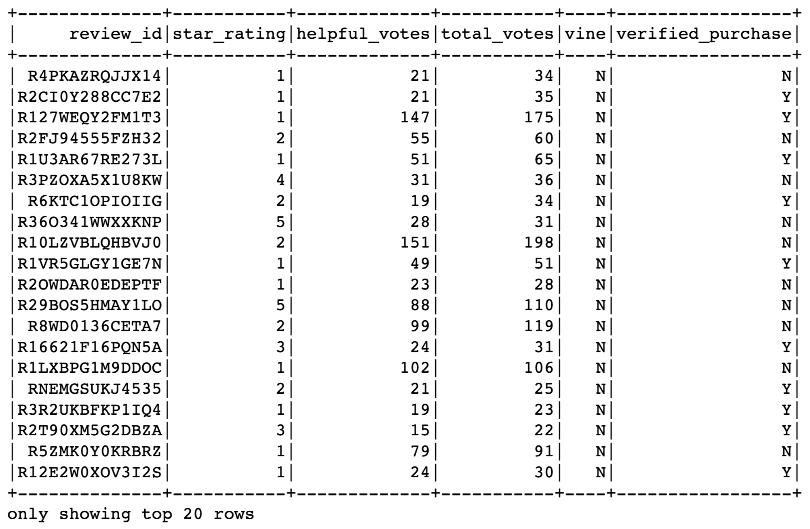
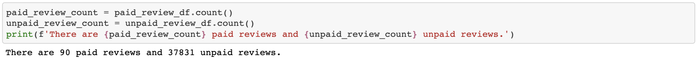
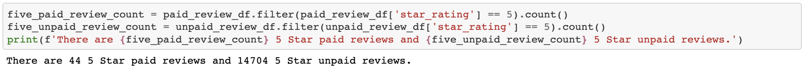
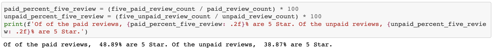

# Amazon_Vine_Analysis
ETL and Sentiment Analysis of Amazon reviews with AWS, PySpark, postgresql, NLP.

## Analysis Overview
In this project an analysis is performed on Amaozon Vine program to check if there exist a bias toward favorable reviews from Vine memebers. In order to complete the analysis PySpark is used to perform the ETL process to extract the dataset, transform the data, connect to an AWS RDS instance, load the transformed data into pgAdmin and calculate different metrics. It is noted that we focused on the US reviews for video games.

## Resources
- Data Source: [Amazon Review datasets](https://s3.amazonaws.com/amazon-reviews-pds/tsv/index.txt), [Video Games Review dataset](https://s3.amazonaws.com/amazon-reviews-pds/tsv/amazon_reviews_us_Video_Games_v1_00.tsv.gz)
- Software: Google Colab Notebook, PostgreSQL 11.9, pgAdmin 4, AWS

## Results
After cleaning the data, a paid and unpaid DataFrame was created. The first 20 rows of each are shown in the images below:

Paid DataFrame

Unpaid DataFrame

A count of each DataFrame yielded 90 paid(Vine) reviews and 37,831 unpaid reviews. This is show below:

The number of 5 Star reviews was calculated for each, 44 5 Star paid reviews and 14704 5 Star unpaid reviews.

And the percentage of 5 Star reviews was 48.89% for paid and 38.87% for unpaid.

## Summary
